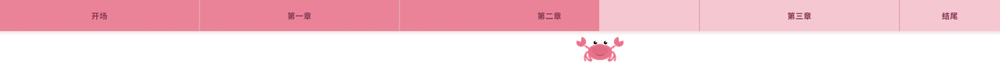

# 视频章节进度条动画 · Chapter Progress Bar v2.0

**一键为 YouTube / 小红书 / 抖音视频生成章节进度条动画** —— 透明背景，可直接叠加在视频上，基于 [Remotion](https://remotion.dev) 的 AI Agent Skill。

v2.0 提供 **6 种进度条风格**（默认米色 Chapter）——可自定义条的位置（顶部/底部）、视频比例（横屏/竖屏），也支持上传 PNG 头像或替换 SVG 吉祥物。

---

## 为什么用代码做视频？ · Why Code Your Edits?

传统剪辑靠拖拽时间轴；用 React + [Remotion](https://remotion.dev) 写代码生成动画，改一行参数就能复用，透明 overlay 导出也更精准。进度条、片头、字幕动效这类**可复用元素**，用代码做往往比手动 K 帧更快、更一致——这也是越来越多创作者在探索的剪辑方式。

👉 想看完整演示，见 Serena 的 YouTube 视频：[你为什么立即要开始写代码做视频，告别手动剪辑](https://youtu.be/fB4uipaYYeU?si=HgXvuPuKfeFQDOUp)

---

## 安装 · Installation

复制下面这句话，发给你的 AI Agent（Claude Code、Cursor、Gemini CLI 等），它会自动安装：

> **"Please install this skill: `https://github.com/serenawangCU/chapter-progress-bar`"**

就这一句，Agent 会自动克隆仓库并读取 `SKILL.md`，之后就能直接使用了。

---

## 6 种风格 · Styles

以下预览均截取于 **3:00** 时刻，便于看清进度效果。默认均为 **顶部 + 横屏 16:9**。

### 位置 & 比例（全部 6 种风格均适用）

| 选项 | 默认 | 说明 |
|------|------|------|
| 位置 | 顶部 | 顶部 / 底部 |
| 比例 | 横屏 16:9 | 横屏 16:9 / 竖屏 9:16 |

**Chapter 风格**已提供现成组件，直接选用即可：

| 位置 | 比例 | 组件 |
|------|------|------|
| 顶部 | 横屏 16:9 | `ChapterProgressBar` |
| 底部 | 横屏 16:9 | `ChapterProgressBarBottom` |
| 顶部 | 竖屏 9:16 | `ChapterProgressBarPortrait` |

**其他 5 种风格**（Dash / Minimal / Text Highlight / Customize / Crab）默认可直接改 Root 的 `width`/`height` 适配竖屏；若要改条的位置（顶部→底部），参考 `ChapterProgressBarBottom.tsx` 的写法，把对应逻辑应用到所选风格的组件里。

---

### 1. Chapter（默认）

米色分段条 + 章节名，支持主标题与副标题两行。


### 2. Dash

分段破折号 + 下方章节名，文字颜色随播放进度变化。


### 3. Minimal

极简单线 + 节点圆点，无章节文字，最简洁。


### 4. Text Highlight

无实体进度条，纯章节名 + `|` 分隔符，已播放部分文字高亮。


### 5. Customize

米色分段条 + **用户上传 PNG 头像**，沿播放进度移动。


### 6. Crab

粉色分段条 + 内置螃蟹 SVG 沿进度爬行（腿有动画，可换配色或替换吉祥物）。



详细对照见 [`references/styles.md`](references/styles.md)。

---

## 功能 · Features

- **6 种视觉风格**：一键切换，默认 Chapter
- **灵活定制**：全部风格可选顶部/底部、横屏/竖屏（Chapter 有现成组件；其他风格参考 Chapter 改法）
- **自动分析字幕**：读取 `.srt` 文件，建议章节划分
- **直接输入时间戳**：无需字幕，自己指定 `2:07 章节名` 格式即可
- **透明背景**：导出 WebM 或 ProRes，直接叠加在视频上
- **附赠章节时间戳格式**：可同时输出 YouTube、小红书、抖音等平台描述可用的时间戳

---

## 使用方式 · How to Use

### 前置条件

- Node.js ≥ 18
- 已安装 Claude Code / Cursor 等 AI Agent

### ⚡ 快速开始

```
帮我做一个视频章节进度条动画。

风格：Chapter（默认）/ Dash / Minimal / Customize / ...
位置：顶部 / 底部
比例：16:9 横屏 / 9:16 竖屏
视频时长：XX 分 XX 秒
章节如下：
0:00 章节一
2:07 章节二
4:46 章节三
...
```

或者直接扔 `.srt` 字幕文件给 Agent，让它自动分析章节。

### 触发方式

**方式一**：slash command
```
/chapter-progress-bar
```

**方式二**：自然语言
```
帮我给这个视频做 Dash 风格的章节进度条，条放底部
帮我做 Customize 进度条，竖屏 9:16，头像用这个 PNG
```

### 流程

1. Agent 读取字幕 / 接收时间戳，确认章节划分
2. **选择 6 种风格之一**（未指定则默认 Chapter）
3. 确认顶部/底部、横屏/竖屏（Chapter 直接换组件；其他风格参考 Chapter 改法）
4. Customize / Crab 按需处理定制素材
5. 创建或复用 Remotion overlay 项目，写入 `src/progress-bars/` 组件
6. 启动预览 `npm run dev`，在浏览器里查看效果
7. 用户确认后，Agent 给出渲染命令（不自动渲染）

---

## 输出格式 · Output

| 格式 | 命令 | 适用场景 |
|------|------|---------|
| WebM (VP8) | `--codec=vp8` | 通用，DaVinci / Premiere |
| ProRes 4444 | `--codec=prores --prores-profile=4444` | Final Cut Pro |

```bash
npx remotion render ChapterProgressBar --codec=vp8 out/progress-bar.webm
npx remotion render DashProgressBar --codec=vp8 out/dash-progress.webm
```

渲染完成后，在剪辑软件里把文件拖到视频轨道**最上层**即可。

---

## 项目结构 · Project Structure

```
src/
├── Root.tsx
└── progress-bars/
    ├── ChapterProgressBar.tsx          ← Chapter 顶部横屏（布局参考基准）
    ├── ChapterProgressBarBottom.tsx    ← Chapter 底部横屏（改位置参考）
    ├── ChapterProgressBarPortrait.tsx  ← Chapter 顶部竖屏（竖屏参考）
    ├── DashProgressBar.tsx
    ├── MinimalProgressBar.tsx
    ├── TextHighlightProgressBar.tsx
    ├── KyomiProgressBar.tsx            ← Customize 风格
    ├── CrabProgressBar.tsx
    └── assets/
        └── kyomi_smile_head_stroke.png
```

---

## 作者 · Author

Made by [心心 Serena](https://www.youtube.com/@serena_xinxin) · [用AI发电社群](https://pathunfold.com/serena)
