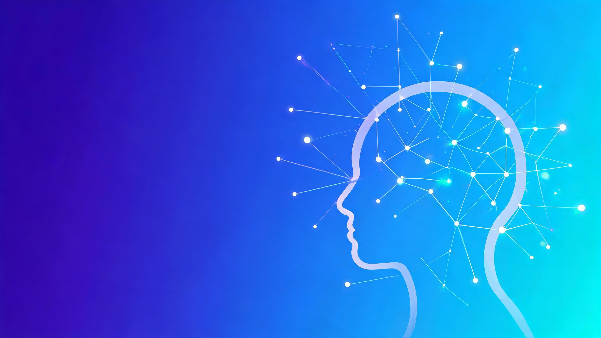

<p align="center">
  
</p>

<p align="center">
  
  
  
  
  
  
</p>

<h1 align="center">🧠 ZFC 最强大脑 · 第二大脑</h1>

<p align="center"><strong>医生专业 × AI 科技 × 安利系统</strong></p>

<p align="center">
一个<b>真实运转中</b>的 Obsidian 第二大脑，服务「AI营养师 · 张医生」的皇冠大使之路。<br>
农村娃 → 省重点奥赛班 → 医学院 → 三甲麻醉医生 → 创业者 → <b>AI营养师</b>
</p>

---

## 🎯 双重使命

| 使命 | 对外表达 | 服务对象 |
|------|---------|---------|
| 🥦 **营养慢病解决方案** | 「我是 AI营养师」 | 顾客 |
| 🤖 **AI 安利系统** | 「我教你成为 AI营养师」 | 合作伙伴 |

> **核心理念：知识不是用来囤的，是用来「运行」的。**

## 🧩 四大板块

| # | 板块 | 入口 | 卡片前缀 |
|---|------|------|---------|
| ① | 营养解决方案 | [01-营养解决方案](02-Areas%EF%BC%88%E8%B0%83%E7%94%A8%E7%9A%84%E7%9F%A5%E8%AF%86%EF%BC%89/01-%E8%90%A5%E5%85%BB%E8%A7%A3%E5%86%B3%E6%96%B9%E6%A1%88) | `KC-营养-*` |
| ② | 创业认知 | [02-创业认知](02-Areas%EF%BC%88%E8%B0%83%E7%94%A8%E7%9A%84%E7%9F%A5%E8%AF%86%EF%BC%89/02-%E5%88%9B%E4%B8%9A%E8%AE%A4%E7%9F%A5) | `KC-创业-*` |
| ③ | 短视频系统 | [03-短视频系统](02-Areas%EF%BC%88%E8%B0%83%E7%94%A8%E7%9A%84%E7%9F%A5%E8%AF%86%EF%BC%89/03-%E7%9F%AD%E8%A7%86%E9%A2%91%E7%B3%BB%E7%BB%9F) | `KC-视频-*` |
| ④ | 带团队 | [04-带团队](02-Areas%EF%BC%88%E8%B0%83%E7%94%A8%E7%9A%84%E7%9F%A5%E8%AF%86%EF%BC%89/04-%E5%B8%A6%E5%9B%A2%E9%98%9F) | `KC-团队-*` |
| ⚡ | 思维操作系统 | [思维操作系统](02-Areas%EF%BC%88%E8%B0%83%E7%94%A8%E7%9A%84%E7%9F%A5%E8%AF%86%EF%BC%89/%E6%80%9D%E7%BB%B4%E6%93%8D%E4%BD%9C%E7%B3%BB%E7%BB%9F) | `KC-认知-*` |

## 📊 数据一览

| 指标 | 数量 |
|------|------|
| 📝 笔记总量 | 2,400+ |
| 🃏 知识卡片（KC-*） | 190 |
| 💡 洞见卡（DJ-*） | 225 |
| 🎬 安利选题脚本 | 60 |
| 🤖 AI 选题脚本 | 23 |

## 🗂️ 目录结构

| 目录 | 作用 |
|------|------|
| [00-灵感库（标记灵感）](00-%E7%81%B5%E6%84%9F%E5%BA%93%EF%BC%88%E6%A0%87%E8%AE%B0%E7%81%B5%E6%84%9F%EF%BC%89) | 灵感入盒 · 知识卡片 · 洞见卡 · 脚本库 ⭐ |
| [01-Projects（进行的项目）](01-Projects%EF%BC%88%E8%BF%9B%E8%A1%8C%E7%9A%84%E9%A1%B9%E7%9B%AE%EF%BC%89) | 四大板块待办看板 |
| [02-Areas（调用的知识）](02-Areas%EF%BC%88%E8%B0%83%E7%94%A8%E7%9A%84%E7%9F%A5%E8%AF%86%EF%BC%89) | 四大板块知识入口 ⭐ |
| [03-Resources（参考的资料）](03-Resources%EF%BC%88%E5%8F%82%E8%80%83%E7%9A%84%E8%B5%84%E6%96%99%EF%BC%89) | 参考素材 · 课件 · 工作文件 |
| [04-Archive（归档的成品）](04-Archive%EF%BC%88%E5%BD%92%E6%A1%A3%E7%9A%84%E6%88%90%E5%93%81%EF%BC%89) | 归档历史 · 成品输出 |
| [05-Skills（技能sop）](05-Skills%EF%BC%88%E6%8A%80%E8%83%BDsop%EF%BC%89) | 技能 · SOP · AI 流水线 |
| [99-独立内容](99-%E7%8B%AC%E7%AB%8B%E5%86%85%E5%AE%B9) | 独立工具 · 小程序 |
| [日记（每日日记）](%E6%97%A5%E8%AE%B0%EF%BC%88%E6%AF%8F%E6%97%A5%E6%97%A5%E8%AE%B0%EF%BC%89) · [每日复盘](%E6%AF%8F%E6%97%A5%E5%A4%8D%E7%9B%98) | 每日流水 · 结构化复盘 |

## ⚡ 三条流水线

```
                  ┌─────────────────────────┐
                  │   🧠 思维操作系统 · 5算子  │
                  └───────────┬─────────────┘
                              ▲
      所有新知识 / 观点 / 素材 │
                              │
    ┌─────────────────────────┴──────────────────┐
    │          灵感入盒 → 分流判断                 │
    └──────┬──────────────────┬──────────────────┘
           ▼                  ▼                  ▼
   ┌──────────────┐  ┌──────────────┐  ┌──────────────┐
   │  流水线 A    │  │  流水线 B    │  │  流水线 C    │
   │  知识加工     │  │  短视频生产   │  │  项目管理    │
   │ 洞见卡→知识卡 │  │ 选题→脚本→交付 │  │ 任务→执行→归档│
   └──────────────┘  └──────────────┘  └──────────────┘
```

## 🔗 快速导航

| 内容 | 位置 |
|------|------|
| 📥 灵感入盒规则 | [00-灵感库](00-%E7%81%B5%E6%84%9F%E5%BA%93%EF%BC%88%E6%A0%87%E8%AE%B0%E7%81%B5%E6%84%9F%EF%BC%89) |
| 🃏 知识卡片库 | [知识卡片](00-%E7%81%B5%E6%84%9F%E5%BA%93%EF%BC%88%E6%A0%87%E8%AE%B0%E7%81%B5%E6%84%9F%EF%BC%89/%E7%9F%A5%E8%AF%86%E5%8D%A1%E7%89%87) |
| 💡 洞见卡库 | [洞见卡](00-%E7%81%B5%E6%84%9F%E5%BA%93%EF%BC%88%E6%A0%87%E8%AE%B0%E7%81%B5%E6%84%9F%EF%BC%89/%E6%B4%9E%E8%A7%81%E5%8D%A1) |
| 🎬 安利选题脚本库 | [安利选题脚本库](00-%E7%81%B5%E6%84%9F%E5%BA%93%EF%BC%88%E6%A0%87%E8%AE%B0%E7%81%B5%E6%84%9F%EF%BC%89/%E5%AE%89%E5%88%A9%E9%80%89%E9%A2%98%E8%84%9A%E6%9C%AC%E5%BA%93) |
| 🤖 AI 选题脚本库 | [AI选题脚本库](00-%E7%81%B5%E6%84%9F%E5%BA%93%EF%BC%88%E6%A0%87%E8%AE%B0%E7%81%B5%E6%84%9F%EF%BC%89/AI%E9%80%89%E9%A2%98%E8%84%9A%E6%9C%AC%E5%BA%93) |
| 🧠 思维操作系统 | [思维操作系统](02-Areas%EF%BC%88%E8%B0%83%E7%94%A8%E7%9A%84%E7%9F%A5%E8%AF%86%EF%BC%89/%E6%80%9D%E7%BB%B4%E6%93%8D%E4%BD%9C%E7%B3%BB%E7%BB%9F) |

---

<p align="center">
  <sub>🧠 ZFC 最强大脑 · Obsidian 第二大脑 · © 2026</sub>
</p>
